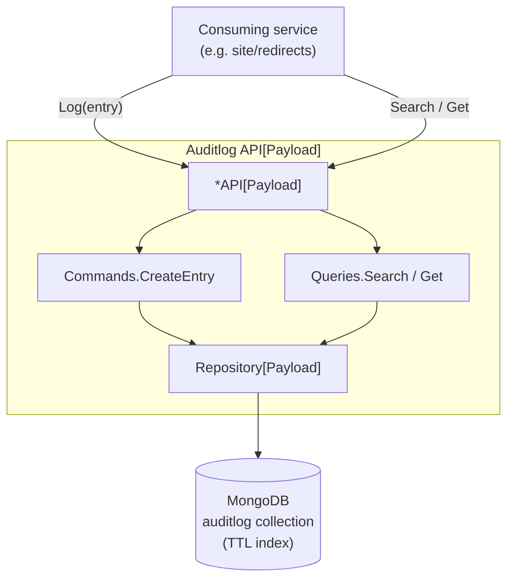

[](https://github.com/foomo/auditlog/actions/workflows/test.yml)
[](https://goreportcard.com/report/github.com/foomo/auditlog)
[](https://godoc.org/github.com/foomo/auditlog)

<p align="center">
  
</p>

# Auditlog

## Introduction and Goals

The **Auditlog** framework provides a generic, type-safe audit log domain for Go services. It captures entries as envelopes around a project-defined `Payload` union and persists them in MongoDB with automatic TTL-based retention.

The domain follows the same shape as `foomo/redirects`: a generic `*API[Payload]` composes command / query handlers around a generic `Repository[Payload]`. Projects parameterise the API with their own typed `Payload` union and own all gotsrpc generation for the wire surface.

## Features

- **Generic entry envelope** — `Entry[Payload any]` carries standard fields (id, timestamp, user, request, service/func/action, entity, ip, user-agent, ttl) and a project-defined payload.
- **MongoDB persistence** — TTL retention is configured at repository construction time via `WithRetention`. The TTL field is anchored on insert.
- **Composable command / query handlers** — `CreateEntry`, `Search`, `Get` mirror the redirects domain so middleware composition is identical (trace events, project-defined wrappers).
- **No gotsrpc surface in the library** — projects declare their own typed Service interfaces over `Entry[ProjectAuditLog]` and run gotsrpc generation themselves. Keeps the library free of `any`-typed wire shapes that confuse the generator.

## System Scope and Context



### Domain layout

- `domain/auditlog/store/` — repository-only primitives (`EntityID`, `DateTime`, `EntityWithTTL`, `Sort`, `PagedResult[T]`, `Search`, `Entry[Payload]` with bson tags). Never appears in a Service signature.
- `domain/auditlog/repository/` — `AuditLogRepository[Payload]` interface + `BaseAuditLogRepository[Payload]` mongo implementation with TTL + compound indexes; `WithRetention`, `WithCollectionName` options.
- `domain/auditlog/command/` — `CreateEntry` command + handler + middleware composer.
- `domain/auditlog/query/` — `Search`, `Get` query handlers + middleware composers.
- `domain/auditlog/api.go` — `*API[Payload]` composes everything and exposes `Log`, `Get`, `Search`.
- `domain/auditlog/public/` — read-side wire types + generic `*Service[Payload]` shell (`Get`, `Search`). Designed for TS export.
- `domain/auditlog/private/` — write-side wire types + generic `*Service[Payload]` shell (`Log`). NOT for TS export. Named `private/` because Go reserves the `internal/` directory name.

## Usage Example

```go
// project payload — declared once, lives next to the rest of the project's
// audit log Service interfaces.
package myaudit

import (
    redirectstore "github.com/foomo/redirects/v2/domain/redirectdefinition/store"
)

type AuditLog struct {
    Redirect *AuditLogRedirect `json:"redirect,omitempty"`
}

type AuditLogRedirect struct {
    Before *redirectstore.RedirectDefinition `json:"before,omitempty"`
    After  *redirectstore.RedirectDefinition `json:"after,omitempty"`
}
```

```go
// service wire-up — one *API[AuditLog] backs both wire-side Services.
package main

import (
    "context"
    "time"

    auditlog "github.com/foomo/auditlog/domain/auditlog"
    auditlogprivate "github.com/foomo/auditlog/domain/auditlog/private"
    auditlogpublic "github.com/foomo/auditlog/domain/auditlog/public"
    auditrepo "github.com/foomo/auditlog/domain/auditlog/repository"
    cmrcmongo "github.com/bestbytes/commerce/pkg/persistence/mongo"
    "github.com/foomo/keel/log"
    "go.uber.org/zap"

    "example.com/myproject/myaudit"
)

func main() {
    ctx := context.Background()
    l, _ := zap.NewProduction()

    persistor, err := cmrcmongo.New(ctx, "mongodb://localhost:27017/local")
    log.Must(l, err, "failed to create persistor")

    repo, err := auditrepo.NewBaseAuditLogRepository[myaudit.AuditLog](l, persistor,
        auditrepo.WithRetention(180*24*time.Hour),
    )
    log.Must(l, err, "failed to create audit log repository")

    api, err := auditlog.NewAPI[myaudit.AuditLog](l, repo)
    log.Must(l, err, "failed to create audit log api")

    publicService := auditlogpublic.NewService[myaudit.AuditLog](l, api)
    privateService := auditlogprivate.NewService[myaudit.AuditLog](l, api)

    _ = publicService  // mount behind the project's public Service interface
    _ = privateService // mount behind the project's internal Service interface
}
```

Each project declares its own concrete (non-generic) `Service` interfaces — one for the public read side (in the api package, mapped to TS via gotsrpc) and one for the internal write side (in the domain package, NOT mapped to TS). The library's generic Services satisfy those interfaces by method-set matching, so projects mount the library Service struct directly with no wrapper struct.

## Configuration Options

The repository supports a small set of construction-time options:

- **`WithRetention(d time.Duration)`** — sets how long entries are kept before the MongoDB TTL index removes them (default: 180 days).
- **`WithCollectionName(name string)`** — overrides the MongoDB collection name (default: `auditlog`).

No additional API options ship in v1. Projects layer their own middleware (telemetry, event publishing, capability checks) via the command/query middleware composers, the same way `foomo/redirects` does.

## Retention

Each audit entry embeds an `EntityWithTTL` field (`ttlTime`). The repository sets `ttlTime = time.Now()` on insert and the MongoDB TTL index expires the document `WithRetention(d)` after that. To change the retention horizon for existing data you must drop and recreate the index (standard MongoDB TTL caveat).

## gotsrpc

The library does **not** ship a sample gotsrpc Service. Projects own:

- their typed `Payload` union,
- their gotsrpc `Service` interface(s) over `Entry[Payload]`,
- the `gotsrpc.yml` and the generated proxy / client / TS bindings.

See the `manorshop` project (`packages/go/api/auditlog` + `packages/go/commerce/domain/auditlog`) for an example of an external read-only / internal write-only split, both wired to a single service struct on different ports.

## How to Contribute

Contributions are welcome! Please read the [contributing guide](docs/CONTRIBUTING.md).


## License

Distributed under MIT License, please see the [license](LICENSE) file within the code for more details.

_Made with ♥ [foomo](https://www.foomo.org) by [bestbytes](https://www.bestbytes.com)_
