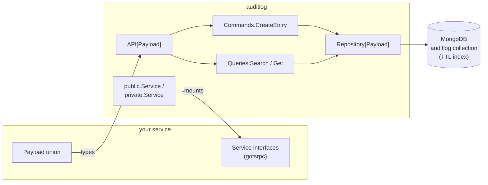

# Architecture

`auditlog` is built around one load-bearing idea: **the library owns the
envelope and the persistence; the consumer owns the payload and the wire
surface.**

## The seam



The library turns each `Log` / `Search` / `Get` call into a typed,
persisted `Entry[Payload]`. The consumer decides what gets logged
(the payload), how the wire surface looks (its own Service interfaces),
and how middleware composes around the handlers.

## `Entry[Payload]`

Every entry is the same envelope, parameterised only by the
project-defined payload:

```go
type Entry[Payload any] struct {
    ID            EntityID
    Timestamp     DateTime
    UserID        string
    RequestID     string
    Service       string
    Func          string
    Action        string
    EntityID      string
    IP            string
    UserAgent     string
    EntityWithTTL        // ttlTime — TTL anchor, storage-only
    Payload       Payload
}
```

## Domain layers

Each layer lives in its own package and is generic over `Payload`. The
import-alias convention is an `x` suffix (`storex`, `repositoryx`,
`commandx`, `queryx`).

| Package | Owns |
| --- | --- |
| `store/` | Repository-only primitives: `Entry[Payload]` (with bson tags), `EntityID`, `DateTime`, `EntityWithTTL`, `Sort`, `Search`, `PagedResult[T]`. **Never appears in a Service signature.** |
| `repository/` | `AuditLogRepository[Payload]` interface + `BaseAuditLogRepository[Payload]` mongo implementation. Construction-time options (`WithRetention`, `WithCollectionName`) and the TTL + compound indexes. |
| `command/` | `CreateEntry` command, handler, and middleware composer. |
| `query/` | `Search` and `Get` handlers + middleware composers. |
| `api.go` | `*API[Payload]` composes the handlers and exposes `Log`, `Get`, `Search`. |
| `public/` | Read-side wire types + generic `*Service[Payload]` (`Get`, `Search`). Intended for TS export. |
| `private/` | Write-side wire types + generic `*Service[Payload]` (`Log`). **Not** for TS export — named `private/` only because Go reserves `internal/`. |

## Load-bearing design choices

### Generic all the way down

`Payload` is threaded through every layer so there is never an
`any`-typed wire shape in the library. This keeps gotsrpc generation
working: a project instantiates the generic Service with its concrete
payload, and the resulting method set matches the project's concrete
`Service` interface — so the project mounts the library struct directly,
with **no wrapper struct**.

### No middleware in `NewAPI`

`NewAPI` applies no middleware. Telemetry, event publishing and
capability checks are project concerns, layered via the command/query
middleware composers — the same way `foomo/redirects` does it. Each
composed middleware emits an OpenTelemetry span event named after the
middleware function, so the trace shape is identical across the two
domains.

### Store types stay out of Service signatures

`store/` is the storage/wire-internal vocabulary. The `public/` and
`private/` layers translate between store types and their own wire types
in `conv.go`. The embedded `EntityWithTTL` is intentionally **dropped**
on the public surface — TTL is a storage concern the read side does not
expose.

## What `auditlog` does not do

- It does not ship a sample gotsrpc Service. You own your typed `Payload`
  union, your Service interface(s), and the `gotsrpc.yml` / generated
  bindings. See [gotsrpc integration](./gotsrpc).
- It does not apply telemetry or event publishing by default — layer your
  own middleware via the composers.
- It does not let you change retention for existing data without
  recreating the TTL index. See [Retention](./retention).
