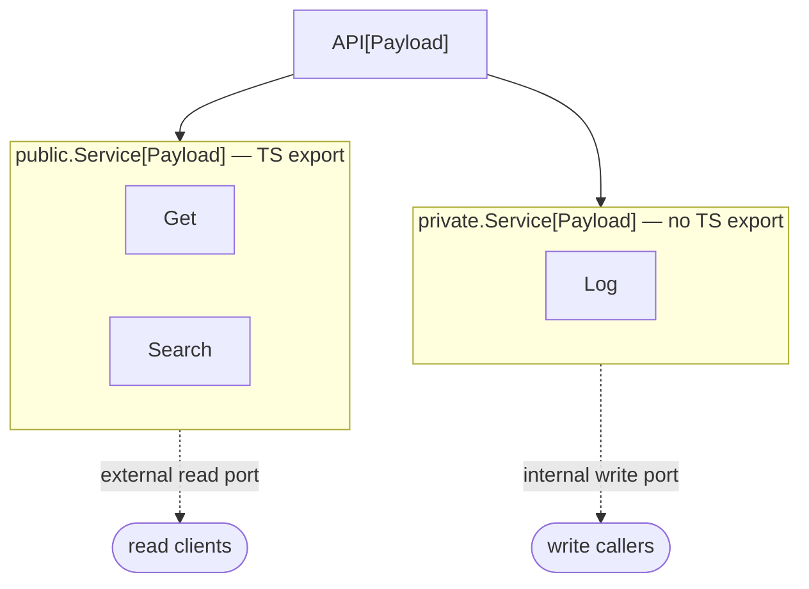

# gotsrpc integration

The library deliberately ships **no gotsrpc Service**. Generating wire
bindings over `any`-typed shapes confuses the generator, so each project
owns its typed surface. This page explains the split and how the generic
Services mount with no wrapper.

## What the project owns

- Its typed `Payload` union.
- Its gotsrpc `Service` interface(s) over `Entry[Payload]`.
- The `gotsrpc.yml` and the generated proxy / client / TS bindings.

## The public / private split

One `*API[Payload]` backs two generic Services from the library:




| Library Service | Methods | Exposed | TS export |
| --- | --- | --- | --- |
| `public.Service[Payload]` | `Get`, `Search` | external read side | yes |
| `private.Service[Payload]` | `Log` | internal write side | no |

`private/` is named that way only because Go reserves the `internal/`
directory name — it is the *write* side, not an access modifier.

## Mounting without a wrapper

Each project declares its own concrete (non-generic) `Service`
interfaces — one for the public read side (mapped to TS via gotsrpc) and
one for the internal write side (not mapped to TS). The library's generic
Services satisfy those interfaces **by method-set matching** once
instantiated with the project's concrete payload, so the project mounts
the library struct directly:

```go
api, _ := auditlog.NewAPI[myaudit.AuditLog](l, repo)

// these satisfy your project's concrete Service interfaces directly —
// no wrapper struct needed
publicService := auditlogpublic.NewService[myaudit.AuditLog](l, api)
privateService := auditlogprivate.NewService[myaudit.AuditLog](l, api)
```

## Method shapes

The library Service methods already have gotsrpc-compatible signatures
(`http.ResponseWriter`, `*http.Request`, typed params, typed result +
`*AuditLogError`):

```go
// public read side
func (s *Service[Payload]) Get(w http.ResponseWriter, r *http.Request, id string) (*Entry[Payload], *AuditLogError)
func (s *Service[Payload]) Search(w http.ResponseWriter, r *http.Request, params *SearchParams) (*PagedResult[Entry[Payload]], *AuditLogError)

// private write side
func (s *Service[Payload]) Log(w http.ResponseWriter, r *http.Request, entry *Entry[Payload]) *AuditLogError
```

## Reference implementation

See the `manorshop` project (`packages/go/api/auditlog` +
`packages/go/commerce/domain/auditlog`) for an external read-only /
internal write-only split, both wired to a single service struct on
different ports.
