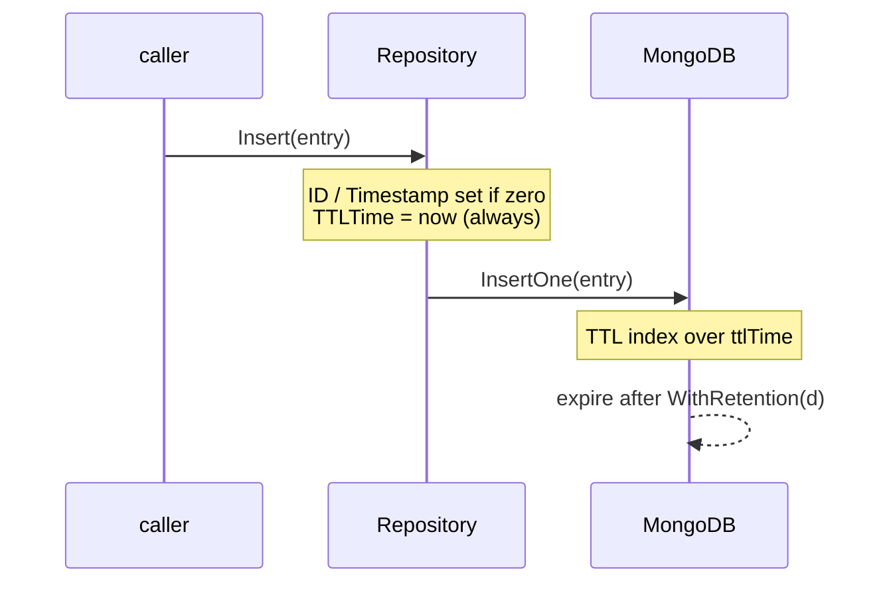

# Retention

Audit entries expire automatically. Retention is a property of the
repository, configured once at construction time and enforced by a
MongoDB TTL index.

## How it works

Every `Entry[Payload]` embeds an `EntityWithTTL` field, persisted as
`ttlTime`:

```go
type EntityWithTTL struct {
    TTLTime time.Time `json:"ttlTime" bson:"ttlTime"`
}
```

`NewBaseAuditLogRepository` creates a TTL index over `ttlTime` with
`expireAfterSeconds` set from `WithRetention` (default **180 days**). On
every `Insert`, the repository **re-anchors `TTLTime = time.Now()`** so
the index always measures retention from insert time:




```go
func (r *BaseAuditLogRepository[Payload]) Insert(ctx, entry) error {
    if entry.ID == "" {
        entry.ID = storex.NewEntityID()
    }
    if entry.Timestamp == "" {
        entry.Timestamp = storex.NewDateTime(time.Now())
    }
    entry.TTLTime = time.Now() // always set, ignores caller value
    // ...
}
```

So callers may leave `ID`, `Timestamp` and `TTLTime` zero — the
repository fills them in. (`ID` and `Timestamp` are only set when zero;
`TTLTime` is always overwritten.)

## Configuring the horizon

```go
repo, err := auditrepo.NewBaseAuditLogRepository[myaudit.AuditLog](l, persistor,
    auditrepo.WithRetention(90*24*time.Hour), // keep entries 90 days
)
```

## The one caveat

A MongoDB TTL index bakes `expireAfterSeconds` into the index itself.
Changing `WithRetention` only affects the index created for a *fresh*
collection — it does **not** retroactively change the horizon for an
existing index. To change retention for existing data you must drop and
recreate the index (standard MongoDB TTL behaviour).

## TTL is storage-only

`TTLTime` never reaches the read-side wire surface. The `public`
conversion (`entryFromStore`) drops the embedded `EntityWithTTL`
deliberately — retention is an operational concern, not part of the
audit record consumers see.
